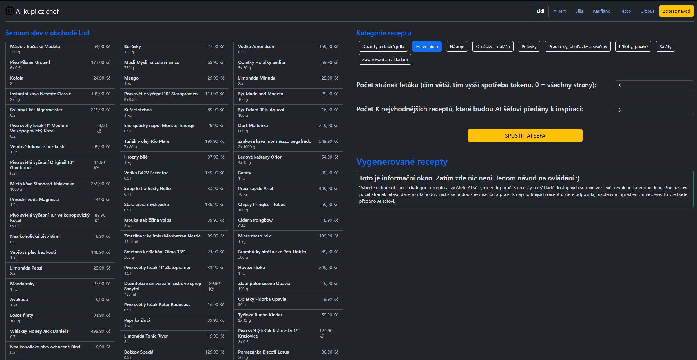
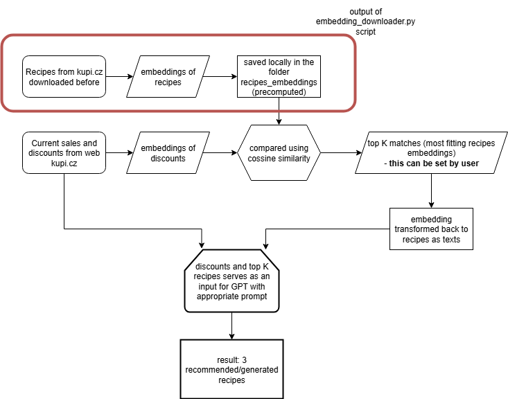

# AI kupi.cz chef

This project is a utilization of **LLM from OpenAI** and my own pip package **kupiapi**. AI kupi.cz chef is RAG (Retrieval-augmented generation) system capable of generating/creating recipes based on the standard recipes available at [https://www.kupi.cz/recepty](https://www.kupi.cz/recepty). The core idea is that AI chef considers sales and discount from selected shop when generating recipes. This allows user to generate recipes from ingredients in sale from his/her favourite grocery shop. 

The application is in Czech language and works with data from Czech shops, scraping them from [https://www.kupi.cz](https://www.kupi.cz). Application is build with Flask in the backend and Bootstrap in the frontend.
In the current state, AI chef can process discounts from these shops (6 well-known shops in the Czech Republic):

- Lidl
- Albert
- Billa
- Kaufland
- Tesco
- Globus

User can set various parameters to influence recipes generation (AI chef generates 3 recipes per request). These parameters are:

- category of recipe (e.g. main dishes, soups, desserts)
- how many pages of discount leaflet should be considered (more pages means more data and higher OpenAI model token consumption). Changing this value forces page reload, because new sales data need to be scrapped and displayed.
- how many of best fitting recipes should AI chef consider when generating new recipes (further explained in section **How it works (technically)**) 

## Installation 

This part describes installation process. Application should work on both Linux/WSL and Windows. Only requirements are some python libraries and OpenAI API key.

1) Pull/clone this respository.
2) Create python virtual environment (optional).
    
    > python -m venv venv
    
    For Linux/WSL
    > source venv/bin/activate
    
    For Windows
    > .\venv\Scripts\activate.bat

3) Install requirements.txt.

    > pip install -r requirements.txt

4) Create OpenAI API key if you dont have one [https://platform.openai.com/docs/quickstart](https://platform.openai.com/docs/quickstart).

5) Application expects API key to be obtained from environment variable **OPENAI_API_KEY**. Do this by the following command.

    For Linux/WSL
    > export OPENAI_API_KEY="your_api_key_here"

    For Windows (YOU HAVE TO RESTART CMD AFTER THIS STEP)
    > setx OPENAI_API_KEY "your_api_key_here"

*Note: It might be required from OpenAI to have some balance in your OpenAI API account. Minimal top up of balance is 5$. One request of AI chef takes around 0.01-0.03$.*

## Usage

Application can be run using command 
    
    python app.py

in the root directory. This will start Flask web application on IP address [http://127.0.0.1:5000](http://127.0.0.1:5000).

In the top navbar, user can select one shop to fetch discounts from. This will reaload the page, scrapes discounts and displays them on the left panel below. On the right side, user can change setting of AI chef. These are described in the first section of this documentation. Clicking on the button **SPUSTIT AI ŠÉFA** the generation process starts with call of OpenAI API. 

**The generation takes some time, so be patient.**

The green box servers as an information window as well as place where generated recipes are displayed.

## How it works (technically)

The application is built as RAG system. This means that knowledge (recipes) have been vectorized into embedding using **text-embedding-3-small** model from OpenAI API. All embedding are provided within this repo in folder *recipes_embeddings*. Original recipes in JSON format scraped using kupiapi library are stored in the folder *recipes_texts*. If you wish to examine process of embeddings creation, feel free to read file **embedding_downloader.py**.

The figure below explains whole generation proccess.

## Further improvements

Some of the future AI chef improvements are listed here, feel free to write me your ideas.

- GPT model selection (currently used GPT-4.1 works fine)
- selection of multiple shops
- storage database of ingredients that user already have at home and could be considered when generating recipe